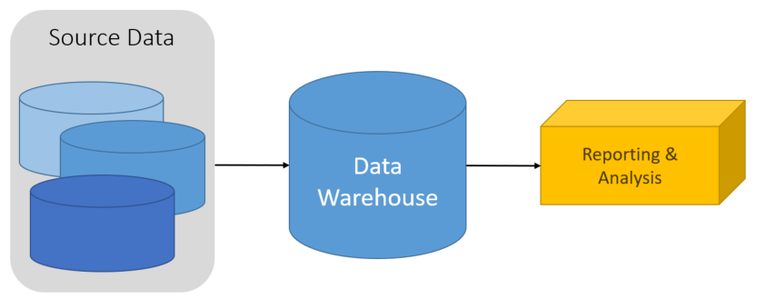

# WIP - Data Warehousing

[About]()  
[When to use this data architecture](#whentouse)  
[Benefits](#benefits)  
[Challenges](#challenges)  
[Data warehousing in Azure](#inazure)   
[Where to go from here](#wheretogo)  

A data warehouse is a central organizational, relational repository of integrated data from one or more disparate sources, across many or all subject areas. Data warehouses store current and historical data and are used for reporting and analysis of the data in different ways.

To move data into a data warehouse, it is extracted on a periodic basis from various sources that contain important business information. As the data is moved, it is formatted, cleaned, validated, summarized, and reorganized. It becomes a permanent storage space for data used for reporting, analysis, and forming important business decisions using business intelligence (BI) tools.

## When to use this architecture

Choose a data warehouse when you need to turn massive amounts of data from operational systems into a format that is easy to understand, current, and accurate so decisions can be made on the data. Data warehouses do not need to follow the same terse data structure you may be using in your operational/OLTP databases. You can use column names that make sense to business users and analysts, restructure the schema to simplify data relationships, and consolidate many tables, such as customers, into one. These steps help guide users who need to create ad-hoc reports, or create reports and analyze the data in BI systems, without the help of a DBA or data developer.

Consider using a data warehouse when you need to keep historical data separate from the source transaction systems, for performance reasons. Data warehouses make it easy to access historical data from multiple locations, by providing common formats, common keys, common data models, and common access methods.

## Benefits

Data warehouses are optimized for read access, resulting in faster report generation compared to running reports against the source transaction systems. In addition, data warehouses provide the following benefits:

* All historical data from multiple sources can be stored and accessed from a data warehouse as the single source of truth. This frees up the operational and transactional systems to only store current and relevant data, potentially giving them a performance boost.
* Improve data quality by cleaning up data as it is imported into the data warehouse, providing more accurate data as well as providing consistent codes and descriptions.
* A data warehouse eliminates the need for reporting tools to compete with the transactional source systems, allowing users to analyze data faster and generate reports more easily, and slice-and-dice in ways they could never do before.
* A data warehouse can help consolidate data within a complex company that uses different software for different divisions.
* Data mining tools can help you find hidden patterns using automatic methodologies against data stored in your warehouse. While reporting tools can tell you where you have been, data mining tools can tell you where you are going.
* Data warehouses make it much easier to provide secure access to authorized users, while restricting access to others. There is no need to grant business users access to the source data, thereby removing a potential attack vector against one or more production transaction systems.
* Having a data warehouse makes it easier to create business intelligence solutions on top of it, such as [OLAP cubes](online-analytical-processing.md).

## Challenges

TODO: ADD CHALLENGES

## Data warehousing in Azure

In Azure, you may have one or more sources of data, whether from customer transactions, or from various business applications used by various departments. This data is traditionally stored in one or more [OLTP](online-transaction-processing.md) databases. The data could also be persisted in other storage mediums such as network shares, blob storage, or a [data lake](../common-architectures/big-data.md#datalake). Your data warehouse would reside in the analytical data store layer. You will need some level of orchestration to periodically move or copy data from your data storage to the warehouse. Finally, analytics and reporting BI tools will connect to the data warehouse for the single source of truth.

![Data warehousing in Azure]](./images/analytical-data-store.png)

## Where to go from here
Read Next:
[Data warehouse technology choices](../technology-choices/data-warehouses.md)

See Also:

Related Technology Choices
- Transactional data stores
    - [Online Transaction Processing (OLTP) data stores](../technology-choices/oltp-data-stores.md)
    - [Online Analytical Processing (OLAP) data stores](../technology-choices/olap-data-stores.md)